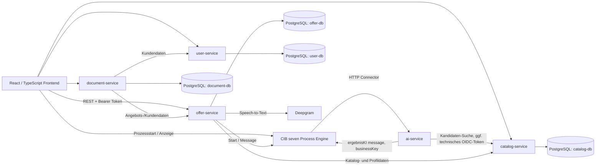

# CraftVoice – technisches Betriebs- und Übergabehandbuch

**Geltungsbereich:** Quellcode und Konfiguration des Repositories `thi-projekte/handwerker` auf `main`, Commit `0b458de63038844d0f028f2d472f251065390a24` (27.09.2026). Dieses Dokument ist für Masterstudierende, nachfolgende Entwicklungsteams und technische KI-Assistenten geschrieben.

**Reifegrad:** technischer Prototyp. Aussagen zu vorhandenem Code sind von Zielbildern, historischen Evaluationen und externen Betriebsannahmen zu unterscheiden. Die Tatsache, dass ein Container gebaut oder eine URL im Code vorkommt, bedeutet nicht, dass der Dienst aktuell erreichbar, abgesichert oder für produktive Nutzung freigegeben ist.

## 1. Zweck und Produktgrenze

CraftVoice soll Handwerksbetriebe bei der digitalen Erfassung und Verwaltung von Angeboten unterstützen. Eine Fachkraft spricht oder erfasst einen Auftrag, erhält einen strukturierten Angebotsentwurf, prüft ihn und kann ein Angebot als PDF erstellen und teilen. Das Frontend enthält außerdem Dashboard-, Profil-, Unternehmens-, Kunden-, Dokument- und öffentliche Angebotsansichten.

Das Repository ist ein technischer Demonstrator und kein vollständiges ERP-, Buchhaltungs- oder Warenwirtschaftssystem. Einzelne Ansichten und APIs sind vorbereitet, aber nicht jede Nutzeroberfläche ist mit jedem Backend-Endpunkt verbunden. Angebote müssen fachlich von einer Person geprüft werden; das Ergebnis einer KI-Evaluation ist kein Nachweis für Produktionsqualität oder rechtliche Eignung.

## 2. Architektur



Die Browser- und Service-URLs stammen aus Frontend-Konfiguration und Compose-Dateien. Die Deployment-Topologie ist nicht vollständig vereinheitlicht. Die Skizze zeigt fachliche Beziehungen, keine Garantie, dass sämtliche Pfeile in jedem Laufprofil aktiviert sind.

### Komponenten

| Komponente | Eigentümlicher Daten-/Fachbereich | Relevante Dateien |
|---|---|---|
| Frontend | Browseransichten und API-Clients | `frontend/src/features/`, `frontend/src/data/`, `frontend/src/config/api.ts` |
| Offer Service | Angebote, Positionen, Statusverlauf, Prozessintegration, Sprachaufnahme | `backend/services/offer-service/` |
| AI Service | Verarbeitung von BPMN-Payloads und KI-Ergebnisnachricht; keine eigene DB | `backend/services/ai-service/` |
| Catalog Service | Materialdaten und Katalogsuche/-importe | `backend/services/catalog-service/` |
| User Service | Benutzer-, Kunden- und Unternehmensprofile | `backend/services/user-service/` |
| Document Service | Dokumenten-API, PDF-Erzeugung und Versand | `backend/services/document-service/` |
| Process Engine | Prozessdefinitionen, Korrelation und Ablaufsteuerung | `processengine/`; Referenzmodelle zusätzlich `docs/bpmn-reference/` |
| Datenbank | Je eine logische Datenbank für Offer, Document, Catalog und User | `backend/docker-compose.yml`, `backend/init/01_create_databases.sql` |

Die Services haben getrennte Datenbanken, laufen im Backend-Compose aber mit demselben PostgreSQL-Server und lokalen `postgres`-Defaults. Eine getrennte Datenbank ist keine vollständige Sicherheitsgrenze, wenn alle Verbindungen dieselben privilegierten Zugangsdaten verwenden.

## 3. Fachlicher Ablauf und Datenverträge

### 3.1 Sprachbasiertes Angebot

1. Das Frontend erfasst Audio und sendet es an `POST /speech-capture/transcribe` des Offer Service. Der Service ruft Deepgram auf und gibt das Transkript zurück.
2. Der Offer Service startet bzw. aktualisiert einen Prozess in der Process Engine. Prozess- und Angebotszustand sind über `businessKey` verknüpft.
3. Ein BPMN-HTTP-Connector ruft `POST /ai/process` auf. Der Endpoint antwortet zunächst mit HTTP 202; LLM-Call 1 läuft danach asynchron (mit konfiguriertem Stub-Fallback), gefolgt von Call 2 für Materialpositionen, parallel ausgeführt. Fehler nach der 202 werden geloggt und können dazu führen, dass der BPMN-Prozess auf sein Ergebnis wartet.
4. Der AI Service erzeugt strukturierte Positionen und korreliert die Message `ergebnisKI` zurück an die Engine. Die Rückgabe ist eine Camunda-Message, deren Prozessvariable `ergebnisKI` ein stringifiziertes JSON enthält. Die asynchrone Korrelation verhindert ein Rennen mit der Engine-Subscription.
5. Die Process Engine mappt die `ergebnisKI`-Variablen in einen Request an den Offer Service. Der aktuelle DTO liest die verschachtelte Struktur; **im Code werden nur `material`-Positionen persistiert und bepreist. KI-`leistungen` werden bewusst ignoriert** (kein `LEISTUNG`-Positionstyp im aktuellen Angebot). Die Arbeitsdauer wird separat im Offer-Service verarbeitet; Arbeitszeit und Anfahrt sind eigene Angebotspositionen.
6. Eine Fachkraft überprüft Positionen, Mengen, Auswahl und Preis. Danach kann sie den Entwurf freigeben, teilen, annehmen oder ablehnen lassen.

Details zum `ergebnisKI`-Schema stehen in [`ergebnisKI-datenvertrag.md`](../backend/services/ai-service/docs/ergebnisKI-datenvertrag.md). Da dieses Dokument als „live verifiziert“ vom 14.06.2026 datiert ist und offene Punkte ausweist, vor API-Änderungen DTOs und BPMN-Mapping im aktuellen Code erneut prüfen.

### 3.2 KI und Materialkatalog

Der AI Service besitzt konfigurierte Primär- und Fallbackmodelle für MegaLLM. Die Konfiguration nennt `gemini-3-flash-preview` und `google-gemma-4-26b`. Für Call 2 ist `CATALOG_MOCK_ENABLED` standardmäßig `true`; ein echter Katalogzugriff erfordert `false`, erreichbaren Catalog Service und funktionsfähige technische Keycloak-Client-Credentials. Die Runtime-Defaults im Code sind maßgeblich gegenüber älteren Eval-Notizen oder einer Datei, die lediglich eine Empfehlung protokolliert.

Evaluationen unter `backend/services/ai-service/docs/` sind historische, projektinterne Messungen mit begrenzten und teilweise synthetischen Szenarien. Sie begründen Modellwahlentscheidungen, ersetzen aber weder aktuelle Anbieter-/Preisprüfung noch reale Abnahme mit Handwerksbetrieben.

### 3.3 Relevante API-Einstiege (aus Quellcode)

| Dienst | Einstieg | Zweck |
|---|---|---|
| Offer | `POST /speech-capture/transcribe` | Audio zu Transkript umwandeln |
| Offer | `POST /offers`, `GET /offers`, `GET /offers/{businessKey}` | Angebot starten, auflisten, abrufen |
| Offer | `POST /angebote/{businessKey}/positionen` | Positionen ändern |
| Offer | `POST /angebote/{businessKey}/ki-ergebnis` | KI-Ergebnis übernehmen; technischer Aufruf erfordert Authentifizierung |
| Offer | `GET/POST /angebote/annahme/{token}` | Öffentliche Ansicht sowie Annahme/Ablehnung über Token |
| Offer | `GET /dashboard` | Dashboard (OWNER-Rolle laut aktuellem Code) |
| AI | `POST /ai/process` | BPMN-Connector-Einstieg; Ergebnis wird asynchron an die Engine korreliert |
| Catalog | `/catalog/material` | Material lesen, anlegen, ändern und deaktivieren |
| Catalog | `GET /catalog/material/search` | Materialsuche |
| Catalog | `POST /catalog/material/import/csv`, `/import/datanorm` | Katalogimport |
| User | `/api/users/*` | Registrierung, Profil, Firmen-, Kunden- und Reisekostenkonfiguration |
| Document | `/documents/*` | PDF generieren, teilen, Metadaten und PDF abfragen |

Die Tabelle ist bewusst eine Orientierung und keine vollständige OpenAPI-Spezifikation. Methoden, Rollen, DTOs, Statuscodes und Requestfelder stehen an den jeweiligen `*Resource.java`-Klassen und müssen dort vor Clientänderungen geprüft werden. Ältere READMEs enthalten teilweise abweichende Pfade.

## 4. Verzeichnisstruktur und Architekturkonventionen

- `frontend/src/features/`: sichtbare Funktionsbereiche; Komponenten liegen überwiegend in `components/`, teils ergänzt um Hooks, Mapper und Types.
- `frontend/src/data/`: API-Clients und Repositories; `frontend/src/core/` und `src/config/` enthalten technische Konfiguration.
- `backend/services/<service>/src/main/java/`: REST-Ressourcen, fachliche Services, DTOs, Clients und Persistenzmodelle des jeweiligen Quarkus-Dienstes.
- `backend/services/catalog-service/src/main/resources/db/migration/`: Flyway-Migrationen (Catalog nutzt Migrationen).
- `backend/services/<service>/src/main/resources/application.properties`: Laufzeit- und profilabhängige Konfiguration.
- `processengine/src/main/resources/processes/`: Prozessmodelle, die der CIB-seven-Prozessanwendung beigelegt sind.
- `docs/bpmn-reference/`: BPMN-Kopien, ausdrücklich nur Referenz.

Die vorhandenen Architektur-Leitfäden waren generische Zielbilder, die den aktuellen Ordnerbaum nicht korrekt beschrieben haben. Für bestehende Implementierung gelten konkrete Quellpfade; neue Komponenten sollen die Verantwortungsgrenzen der Services wahren.

## 5. Konfiguration und externe Abhängigkeiten

Konfiguration erfolgt überwiegend über Umgebungsvariablen und `application.properties`. Defaultwerte im Repository sind Entwicklereinstellungen, kein Secret-Management.

| Abhängigkeit / Variable | Verwendung | Übergabehinweis |
|---|---|---|
| PostgreSQL (`DB_HOST`, `DB_NAME`, `DB_USER`, `DB_PASSWORD`) | Datenbankverbindung der Services | Compose enthält einfache Defaults; vor extern erreichbarem Betrieb durch separate minimale DB-Accounts/Secrets ersetzen. |
| Deepgram (`DEEPGRAM_API_KEY`) | Speech-to-Text im Offer Service | Eigener API-Schlüssel nötig; vorhandenes Beispiel-Env-File konnte im Repository nicht gefunden werden. |
| MegaLLM (`MEGALLM_API_URL`, `MEGALLM_API_KEY`, `MEGALLM_MODEL`, `MEGALLM_MODEL_FALLBACK`) | KI-Aufrufe | Schlüssel ausschließlich in Secret-Store bzw. lokalem Env; Kosten und Limits überwachen. |
| Process Engine (`PE_URL`, `CAMUNDA_ENGINE_URL`) | Angebotsstart und KI-Korrelation | Hostnamen/Ports sind in Modul-, Compose- und Frontend-Defaults nicht einheitlich. Pro Umgebung explizit setzen und Roundtrip verifizieren. |
| Keycloak (Issuer, Realm, Client, Client-Secret) | Authentifizierung/Autorisierung; technisches AI→Catalog-Token | OIDC ist in mehreren Entwicklungssettings ausgeschaltet; `AI_SERVICE_OIDC_SECRET` benötigt ein echtes Secret. Keine Secrets in Git. |
| CIB seven Enterprise Maven-Repository | Build der Process Engine | Zugriffsdaten getrennt von Runtime-Secrets übergeben; lokale `~/.m2/settings.xml` nicht committen. |
| GitHub Container Registry | Container-Images | Workflows veröffentlichen Images; kein Workflow im Repository führt einen vollständigen Server-Rollout aus. |

**Sicherheitsbefund für die Übergabe:** Die versionierte `backend/services/user-service/src/main/resources/application.properties` enthält feste Keycloak-Admin-Zugangswerte, die nicht als sichere Konfiguration behandelt werden dürfen. Vor produktivem Einsatz Zugangsdaten entfernen/rotieren und aus Secrets injizieren. Compose-Dateien verwenden außerdem Datenbank-Defaults und schalten OIDC teils per Default aus. Diese Dokumentation wiederholt keine Secret-Werte.

## 6. Lokal entwickeln

### Frontend

```bash
cd frontend
npm ci
npm run dev
```

Vite/Node 20 sind in CI festgelegt. `npm run lint`, `npm run typecheck` und `npm run build` sind im `package.json` definiert. Das Frontend liest API-Adressen aus `VITE_*_SERVICE_URL` und besitzt Fallback-Adressen, die auf externe Hostnamen verweisen; für eine lokale Umgebung müssen diese URLs passend überschrieben werden.

### Backend

Für einen einzelnen Quarkus-Service:

```bash
cd backend/services/offer-service
./mvnw quarkus:dev
```

Der aktuelle `backend/docker-compose.yml`-Stack hat einige wichtige Grenzen:

1. PostgreSQL-Port 5432 wird nicht auf den Host veröffentlicht. Ein auf dem Host gestarteter Quarkus-Prozess kann den Compose-Hostnamen `postgres` daher nicht direkt auflösen.
2. Es gibt keine versionierte `backend/docker-compose.dev.yml`, obwohl mehrere alte READMEs deren Verwendung beschreiben.
3. Der Stack listet Offer, User, Catalog und Document, aber nicht `ai-service`, Keycloak oder die Process Engine. Für `ai-service` existiert ein separates Compose-File unter `backend/services/ai-service/docker-compose.yml`.
4. Compose setzt für `offer-service` `PE_URL=http://host.docker.internal:8081/engine-rest`; `processengine/docker-compose.yml` bildet standardmäßig Engine-Port 8080 ab. Dieser Unterschied muss aufgelöst werden.
5. `CATALOG_MOCK_ENABLED` und AI-Service-Containerkonfiguration fehlen im Root-Backend-Compose.

Daher existiert im Repository derzeit kein einzelner verifizierter Compose-Befehl, der ein End-to-End-System lokal startet. Vor Änderungen an den Compose-Dateien Netzwerk-, Port-, Credential- und Startreihenfolge festlegen. Wer nur eine Komponente entwickelt, kann mit separater DB/Engine und expliziten Variablen arbeiten; diese Infrastruktur ist nicht vollständig als Dev-Profil dokumentiert.

### Process Engine

Der Engine-Build benötigt Java 17, Maven und Zugriff auf das geschützte CIB seven Enterprise Repository. Details: [Process Engine README](../processengine/README.md). Engine-Compose erwartet das externe Docker-Netz `nginx-proxy-manager`.

## 7. Datenhaltung und Migrationen

`backend/init/01_create_databases.sql` legt vier Datenbanken an. PostgreSQL-Init-Skripte werden vom offiziellen Image nur bei einem neu initialisierten leeren Volume ausgeführt. Ein später geändertes Init-SQL migriert kein bestehendes Volume automatisch. Catalog enthält Flyway-Skripte `V1` bis `V3`; andere Services konfigurieren überwiegend Hibernate `database.generation=update`. Das ist bequem für Entwicklung, aber kein belastbarer Produktions-Migrationsprozess.

Persistenzvolumes im Backend-Compose heißen `postgres_data` und `document_files`. Ein Containerneustart mit `docker compose down` löscht benannte Volumes in der Regel nicht; `down -v` entfernt sie und kann Daten zerstören. Vor Wiederherstellungs-/Bereinigungsbefehlen erst klären, ob persistente Daten gebraucht werden.

Das Repository beschreibt keine verifizierten Backup-Zeitpläne, Aufbewahrung, Verschlüsselung, Restore-Tests oder Eigentümer. Diese Betriebsdaten müssen vom Infrastrukturteam ergänzt werden, bevor produktive Datensätze verwaltet werden.

## 8. Authentifizierung, Datenschutz und Sicherheitsgrenzen

- Frontend verwendet `keycloak-js`; Backend-Services konfigurieren OIDC jedoch unterschiedlich. Vor einem Rollout müssen alle öffentlich erreichbaren Routen und Service-zu-Service-Aufrufe geprüft werden.
- Backend-Compose setzt `QUARKUS_OIDC_TENANT_ENABLED=false` für User- und Catalog-Service. Der Offer Service hat eine OIDC-Konfiguration; dessen Compose-Umgebungsvariablen überschreiben sie nicht ersichtlich.
- Die Process-Engine-Anwendung konfiguriert OIDC Issuer und Resource-Server, aber `camunda.bpm.authorization.enabled` ist `false`.
- AI-Service verwendet im Real-Katalogmodus Client-Credentials und `X-Handwerker-Id`; bei `CATALOG_MOCK_ENABLED=true` wird die echte Keycloak-Verbindung nicht für diesen Katalogpfad gebraucht.
- Speech-Aufnahmen werden an Deepgram übertragen. Die Speech-Ressource löscht die temporäre Upload-Datei und überschreibt das eingelesene Byte-Array im `finally`-Block; Netzwerkübertragung und Transkript bleiben trotzdem externe bzw. persistente Verarbeitungsdaten.
- Katalogpreise und Arbeitskosten sollen nicht an das LLM gelangen. Änderungen an Prompts/DTOs müssen diese Datenflussgrenze erhalten.
- Demo-/Seed-Daten und personenbezogene Beispieldaten vor Weitergabe, Deployment oder Screenshots prüfen.

Dieses Handbuch ist keine Sicherheitsfreigabe und keine Rechtsberatung. Mindestens Secret-Rotation, Zugriffsmatrix, CORS/HTTPS, Protokollierung personenbezogener Daten, Lösch-/Aufbewahrungsregeln und öffentliche PDF-/Token-Endpunkte gehören in eine explizite Abnahme.

## 9. CI, Container und Bereitstellung

### GitHub Actions

| Workflow | Auslöser | Was er tut | Was er nicht tut |
|---|---|---|---|
| `frontend-ci.yml` | Push auf `main`, `sprint*`, `v*`; PR gegen `main`/`sprint*` | `npm ci`, ESLint, Typecheck, Vite-Build; bei Push Imagebau/-push nach GHCR | Kein Rollout auf einen Laufzeitserver |
| `backend-ci.yml` | Push auf `main`, `sprint*`, `v*`; PR gegen `main`/`sprint*`; manuell | Matrix aus fünf Services, `mvn clean test`, `mvn package -DskipTests`; bei Push Container veröffentlichen | Kein Datenbank-/BPMN-Migrations- oder Deployment-Schritt |
| `processEngine-ci.yml` | Tags `v*`; PR gegen `main`/`sprint*`; manuell | Java-17-/Maven-Build mit CIB-Secrets, Process-Engine-Container veröffentlichen | Push auf `main` allein veröffentlicht laut Workflow keinen Engine-Container; kein Rollout |

Die Frontend-Image-Tags haben u.a. `latest` auf `main` und `sprint4` auf `sprint4`; Backend-Workflow bildet Branch-/SHA-Tags und `latest` für Versionstags. Die Process Engine verwendet einen eigenen Imagepfad. Tags im Compose müssen mit tatsächlich verfügbaren Images synchron gehalten werden.

### Compose-Dateien und Betriebsmodell

- `backend/docker-compose.yml`: lokaler Backend-Containerstack, baut Service-Container aus Quellen, veröffentlicht Nginx auf Host-Port 8080. Die Konfiguration verwendet Entwicklungs-Defaults.
- `frontend/docker-compose.yml`: lädt `ghcr.io/thi-projekte/handwerker/frontend:latest` und hängt sich an ein externes Docker-Netz `nginx-proxy-manager`; Reverse-Proxy/TLS erfolgt außerhalb dieses Compose-Projekts.
- `processengine/docker-compose.yml`: baut/lädt Engine auf konfigurierbarem Host-Port (Default 8080), ebenfalls mit dem externen Proxy-Netz.
- Es gibt keinen durchgängigen Deployment-Workflow, keine versionierte Produktions-Env-Datei, keine dokumentierte Rollback-Prozedur und keinen bestätigten Serverzustand im Repository.

Für einen kontrollierten Rollout wären mindestens nötig: immutable Image-Tags je Release, Deployment-Owner und Zugänge außerhalb Git, Secret-Quelle, gesicherte DB-Migration, Reihenfolge von Engine/BPMN und Services, Health-Checks, Smoke-Test, Rollback-Plan sowie Datenbankbackup. Diese Punkte sind noch nicht als automatisierter Prozess im Repository abgebildet.

## 10. Fehlerdiagnose

| Symptom | Erste Prüfung |
|---|---|
| Service startet nicht wegen DB-Host `postgres` | Läuft der Service im Compose-Netz? Ein Hostprozess kennt den Compose-DNS-Namen nicht. Host-Port-Mapping fehlt im aktuellen Compose. |
| Angebotsprozess wartet nach AI-Aufruf | `businessKey`, BPMN-`messageName` (`ergebnisKI`), Prozesssubscription, PE-URL und AI-Log korrelieren; Async-Message-Pattern beachten. |
| AI meldet Katalogfehler | `CATALOG_MOCK_ENABLED`, Catalog-URL, Bearer-Token/Client-Credentials und `X-Handwerker-Id` prüfen. |
| Audio-Transkription gibt 502/leer zurück | `DEEPGRAM_API_KEY`, MIME-Type/Multipart-Feld `audio`, Provider-Erreichbarkeit und Limits prüfen. |
| Container kann Registry nicht laden | Imagepfad/-tag, GHCR-Paketberechtigung und externe Proxy-Netzwerke prüfen. |
| Process-Engine-Build scheitert beim Download | Lokale Maven-Server-ID/Secrets für CIB seven Enterprise prüfen; keine Zugangsdaten committen. |
| Quarkus-Devmodus erreicht Keycloak unerwartet | OIDC-Profil/Umgebungsvariablen des konkreten Services und Testprofil unterscheiden; Konfiguration ist nicht einheitlich. |

## 11. Änderung und Review

1. Vor Änderung den fachlichen Eigentümer der betroffenen Service-API bzw. BPMN-Definition feststellen.
2. Den tatsächlichen Resource-/DTO-/Config-Code und Verbraucher (Frontend, andere Services, BPMN) lesen.
3. Vertrag und Fehlerverhalten in der zugehörigen Service-Dokumentation aktualisieren.
4. Für Modell-/Promptänderungen Preisfreiheit, Ablehnungsverhalten, Mengen-/Einheitenvertrag und Regressionsevaluation beachten.
5. Für Auth-/Datenmodell-/BPMN-Änderungen migrations- und abwärtskompatiblen Rollout planen.
6. Review und CI für das betroffene Modul einholen. Betriebsdeployments sind ein separater Schritt und dürfen nicht aus einem erfolgreichen CI-Build abgeleitet werden.

## 12. Offene Übergabe-Checkliste

Die folgenden Punkte sind nicht zuverlässig aus Git ableitbar. Vor Projektübergabe müssen die zuständigen Menschen bzw. Organisationen sie ergänzen:

- [ ] Welche Umgebung/Server und welche Domains sind aktuell aktiv, wer ist technischer Eigentümer und wie wird Zugriff übertragen?
- [ ] Welche Images/Tags laufen tatsächlich und in welcher Reihenfolge werden Frontend, Services, Engine und BPMN aktualisiert?
- [ ] Wo werden Postgres-, Keycloak-, Deepgram-, MegaLLM-, SMTP- und CIB-Repository-Zugangsdaten verwaltet; wer rotiert sie?
- [ ] Sind die in `user-service` versionierten Admin-Defaults entfernt/rotiert? Sind DB-Accounts pro Dienst minimal berechtigt?
- [ ] Wie sehen Backups, Restore-Tests, Lösch-/Aufbewahrungsfristen und Incident-Kontakte aus?
- [ ] Welche BPMN-Quelle ist maßgeblich, wer darf sie ändern und wie wird ein Modell in die Ziel-Engine deployed?
- [ ] Ist der produktive Katalogmodus `CATALOG_MOCK_ENABLED=false` vorgesehen und sind Client-Rollen sowie Eigentümer-Mandantenzuordnung konfiguriert?
- [ ] Werden von der KI erstellte `leistungen` künftig zu echten Angebotspositionen? Im aktuellen Offer Service werden sie ignoriert.
- [ ] Welche Features sind fachlich abgenommen, welche Demonstrator-/Seed-Daten und bekannten Fehler gehören zum akzeptierten Lieferumfang?
- [ ] Ist Deepgram-Audioverarbeitung mit dem Datenschutzkonzept/Einwilligungsprozess der Zielumgebung abgestimmt?

Die Beantwortung dieser Punkte ergänzt dieses Dokument; Zugangsdaten selbst gehören in einen kontrollierten Secret-Manager, niemals in Markdown oder Git.

